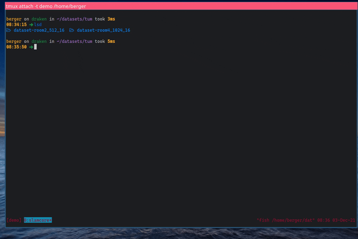
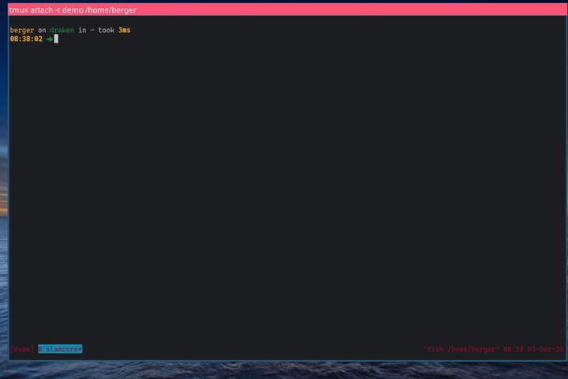

# slamcore_utils

<a href="https://github.com/slamcore/slamcore_utils/actions" alt="CI">
</a>

<a href="https://github.com/slamcore/slamcore_utils/blob/master/LICENSE.md" alt="LICENSE">
</a>
<a href="https://pypi.org/project/slamcore_utils/" alt="pypi">
</a>
<a href="https://github.com/slamcore/slamcore_utils/actions" alt="lint">
</a>
<a href="https://badge.fury.io/py/slamcore_utils">
</a>
<!-- <a href="https://pepy.tech/project/slamcore_utils"> -->
<!-- </a> -->
<a href="https://github.com/psf/black">
</a>

## Description

<!-- Change this when we add more scripts -->

This repo contains the `slamcore-setup-dataset` script. It can be used for
installing a sample dataset for offline testing and evaluation of [SLAMcore][slamcore]'s
Localization and Mapping capabilities.

Currently the following types of datasets are supported:

- [EuRoC MAV Datasets](https://projects.asl.ethz.ch/datasets/doku.php?id=kmavvisualinertialdatasets)
- [OpenLORIS-Scene Datasets](https://lifelong-robotic-vision.github.io/dataset/scene)
- [TUM VI Datasets](https://vision.in.tum.de/data/datasets/visual-inertial-dataset)

## Usage

After [installation](#installation) the script should be available in your path.
Executing it will guide you through a list of questions in order to properly
setup a sample SLAM dataset.

Here is a sample execution of the said script to enable processing of the `TUM-VI`
`dataset-room4_1024_16`



Here's the same execution for the `OpenLORIS` `cafe1-1` dataset


And here's the execution guiding the user to the right download page, when
the datasets are not available locally yet.



## Installation

Install it directly from PyPI:

```sh
pip3 install --user --upgrade slamcore_utils[tqdm]

# Or if you don't want polished tqdm's progress bars
pip3 install --user --upgrade slamcore_utils
```

<details>
  <summary>I don't want to have to install it</summary>

Make sure the project dependencies are installed:

`pip3 install -r requirements.txt`

Then adjust your `PYTHONPATH` variable and run accordingly:

```sh
git clone https://github.com/slamcore/slamcore_utils
cd slamcore_utils
export PYTHONPATH=$PYTHONPATH:$PWD
./slamcore_utils/scripts/setup_dataset.py
```

</details>

<details>
  <summary>I don't want to install any of your dependencies in my user's install directory</summary>

Consider using either [pipx](https://github.com/pypa/pipx) or
[poetry](https://github.com/python-poetry/poetry) to install this package and
its dependencies isolated in a virtual environment:

```sh
git clone https://github.com/slamcore/slamcore_utils
poetry install
poetry shell

# the executables should now be available in your $PATH
setup-dataset
```

</details>

## About SLAMcore

[SLAMcore][slamcore] offers commercial-grade visual-inertial
simultaneous localisation and mapping (SLAM) software for real-time autonomous
navigation on robots and drones. [Request
access](https://www.slamcore.com/sdk-access) today to get started.


[slamcore]: https://www.slamcore.com/
